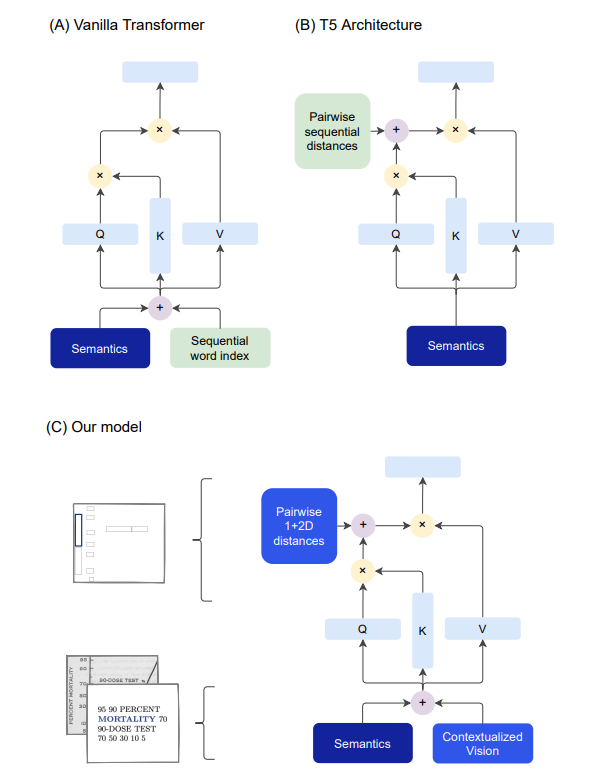

## Going Full-TILT Boogie on Document Understanding with Text-Image-Layout Transformer: PyTorch Implementation



This repository contains the implementation of the paper: [Going Full-TILT Boogie on Document Understanding with Text-Image-Layout Transformer](https://arxiv.org/pdf/2102.09550v3.pdf). Note that, the authors have not released the original implementation of the paper.

Abstract: We address the challenging problem of Natural Language Comprehension beyond plain-text documents by introducing the TILT neural network architecture which simultaneously learns layout information, visual features, and textual semantics. Contrary to previous approaches, we rely on a decoder capable of unifying a variety of problems involving natural language. The layout is represented as an attention bias and complemented with contextualized visual information, while the core of our model is a pretrained encoder-decoder Transformer. Our novel approach achieves state-of-the-art results in extracting information from documents and answering questions which demand layout understanding (DocVQA, CORD, SROIE). At the same time, we simplify the process by employing an end-to-end model.


## Requirements
* See in the requirements.txt file


## Dataset
* I would be including the [FUNSD Dataset](https://guillaumejaume.github.io/FUNSD/), as well as the [CORD Dataset](https://github.com/clovaai/cord) soon. Currently, the entire approach is being implemented, and due to my silly mistakes, it would take me a while to prepare the entire pipeline.


## Pretrained Models
* I am not sure, if I would be able to include the pretrained models, due to resource constraints, but would add the finetuning code for FUNSD, CORD and DocVQA soon.


## Modeling:
* The modeling part of the pipeline, basically is inspired from [HuggingFace's T5 implementation](https://huggingface.co/docs/transformers/model_doc/t5), and the initialization of the weights are being done from the same. The code for the same is available in the `modeling.py` file.


## Examples:
* For finetuning TiLT on CORD, the example along with the results are present [here](https://github.com/uakarsh/TiLT-Implementation/blob/main/experiments/cord-tilt-part-4-1-abstractive-approach-for-t.ipynb)

* Similarily, for finetuning TiLT on FUNSD, the example along with the results are present [here](https://github.com/uakarsh/TiLT-Implementation/blob/main/experiments/tilt-part-4-1-abstractive-approach-for-training.ipynb)


## My Results:
| Model Name      | Dataset Name | Number of Parameters | Overall Precision | Overall Recall | Overall F1 Score | Overall Accuracy |
|-----------------|--------------|----------------------|-------------------|----------------|------------------|------------------|
| TILT            | FUNSD        |  225M                | 57.58             | 42.25          | 48.87            | 83.60            |
| TILT            | CORD         |  225M                | 64.81             | 62.64          | 63.71            | 80.52            |
| TILT(Original)  | CORD         |  230M                | ---               | ---            | 95.11            | ---              |

Note, that in the case of my results on CORD, the model has not been pre-trained (the weights are intialized from the hugging face's implementation), and it has been trained for 30 epochs, while in the original paper, the authors have trained on 360,000 steps which is roughly equivalent to 360,000 / 100 = 360 epochs. (100 comes from 800 / 8, since 8 is the batch size mentioned in the paper, and 800 are the training examples in the CORD dataset)

## Citation
If you find this repository useful, please cite the following paper:
```bibtex
@inproceedings{powalski2021going,
  title={Going full-tilt boogie on document understanding with text-image-layout transformer},
  author={Powalski, Rafa{\l} and Borchmann, {\L}ukasz and Jurkiewicz, Dawid and Dwojak, Tomasz and Pietruszka, Micha{\l} and Pa{\l}ka, Gabriela},
  booktitle={Document Analysis and Recognition--ICDAR 2021: 16th International Conference, Lausanne, Switzerland, September 5--10, 2021, Proceedings, Part II 16},
  pages={732--747},
  year={2021},
  organization={Springer}
}
```

## License
This project is licensed under the MIT License - see the LICENSE file for details
